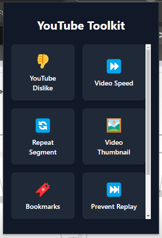
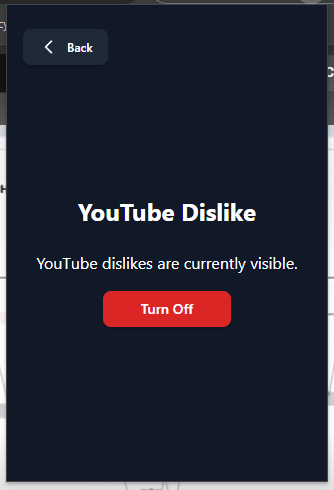

# YouTube Toolkit Extension for Google Chrome!

This Extension contains some useful tools to use while Using YouTube!

## What Tools?

-   ### YouTube Dislike
    > Enable YouTube Dislike count view
-   ### Video Speed Customization
    > Customize YouTube video speed as you wish! (2x, 4x, 8x or anything you want!)
-   ### Repeat Segment
    > Repeat Specific Segment of the Video. (For example, from 00:10:22 to 00:11:20. It will repeat the segments as long as you want!)
-   ### MORE INCOMING!!!

## Screenshots!

## How to Use?

-   Download the Zip File from the [Download URL](https://github.com/TheProjectsX/youtube-toolkit/releases/download/YouTubeToolkit/YouTube-Toolkit.zip) or [Release Page](https://github.com/TheProjectsX/youtube-toolkit/releases)
-   Unzip the File
-   Go To `Manage Extension` from your Google Chrome or Directly go to `chrome://extensions/`
-   Turn on `Developer Mode` (Top Right corner)
-   Click on `Load Unpacked` (Top Left corner of new Menu)
-   Select the Correct Folder of the Unzipped Extension

WALA!

Start using The YouTube tools!!!

### Why not Uploaded in Chrome Web Store?

Well, I am a `Unemployed Developer`. Don't have the means to spend 5$ just to get registered as a Developer!

# For my Fellow Developers (& Future Me!):

## How and What?

-   ### This Extension was created using React JS.
-   ### Here are the Steps::

-   Create a Regular React JS project. (Use Vite or whatever)
-   We will create our `popup` html and js as a regular React JS project.
-   The Next thing we will do in our `public` directory:
    -   Create a `manifest.json` file and add necessary `Things`.
    -   Add `index.js` as `default_popup`
    -   Create `content` script and `background` script here.
    -   Add the paths of the `content` script and `background` script in the `manifest.json` file but relative to the public folder. (Think of public folder as root directory)
    -   Read DOCs (or get help from ChatGPT) and create your Extension!!!!!!
-   And there is this Repository to Get the Ideas! (or Helps!)
